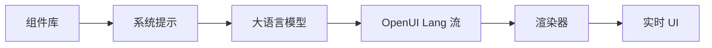

<div align="center">

<a href="https://www.openui.com" target="_blank" rel="noopener noreferrer">
  
</a>

# OpenUI - 生成式 UI 的开放标准

<p align="center">
  <a href="https://github.com/thesysdev/openui/actions/workflows/build-js.yml"></a>
  <a href="https://github.com/thesysdev/openui/blob/main/LICENSE"></a>
  <a href="https://discord.com/invite/Pbv5PsqUSv"></a>
</p>

<a href="https://trendshift.io/repositories/22357" target="_blank"></a>

</div>

OpenUI 是一个全栈、渲染器无关的生成式 UI框架，围绕一种紧凑的、流式优先的语言构建。它提供官方的 React 支持，内置组件库和开箱即用的聊天界面，以及社区支持的其他框架集成。OpenUI Lang 比 JSON 最多减少 67% 的 token 使用量。

<div align="center">

[文档](https://openui.com) · [游乐场](https://www.openui.com/playground) · [Discord](https://discord.com/invite/Pbv5PsqUSv) · [贡献指南](https://github.com/thesysdev/openui/blob/main/CONTRIBUTING.md)

</div>

> **重要提示：** OpenUI 没有官方的加密货币、代币或硬币。任何使用 OpenUI 名称的资产均与本项目无关，也未得到其维护者的认可。

---

## 什么是 OpenUI

<div align="center">


</div>

OpenUI 的核心是 **OpenUI Lang**：一种用于模型生成 UI 的紧凑、流式优先的语言。OpenUI 不仅将模型输出视为纯文本，还允许你定义组件、从组件库生成提示指令，并在模型流式输出时渲染结构化的 UI。

**核心能力：**

- **OpenUI Lang** - 一种为流式输出设计的结构化 UI 生成紧凑语言。
- **内置组件库** - 图表、表单、表格、布局等，可直接使用或扩展。
- **从组件库生成提示** - 直接从你允许的组件生成模型指令。
- **流式渲染器** - 在 React 中随着 token 到达逐步解析和渲染模型输出。
- **聊天和应用界面** - 使用相同的基础架构构建助手、副驾驶和更广泛的交互式产品流程。

## 快速开始

```bash
npx @openuidev/cli@latest create --name genui-chat-app
cd genui-chat-app
echo "OPENAI_API_KEY=sk-your-key-here" > .env
npm run dev
```

这是开始使用 OpenUI 的最快方式。脚手架应用为您提供了一个端到端的起点，包含流式处理、内置 UI 和 OpenUI Lang 支持。

这为您提供：

- **OpenUI Lang 支持** - 从应用流程内置的结构化 UI 生成开始。
- **库驱动的提示** - 从您允许的组件集合生成指令。
- **流式支持** - 随着输出到达逐步更新 UI。
- **可用的应用基础** - 从现成的示例开始，无需手动连接所有组件。

## 工作原理

你的组件定义了模型可以生成什么。



1. 定义或复用组件库。
2. 从该库生成系统提示。
3. 将该提示发送给您的模型。
4. 将 OpenUI Lang 输出流式传输回客户端。
5. 使用渲染器逐步渲染输出。

在 [Playground](https://www.openui.com/playground) 中亲自尝试：使用默认组件库实时生成 UI。

## 包

| Package                                                                                                    | 适用场景                                         | 描述                                                                                                  |
| :--------------------------------------------------------------------------------------------------------- | :----------------------------------------------- | :----------------------------------------------------------------------------------------------------------- |
| [`@openuidev/lang-core`](https://github.com/thesysdev/openui/tree/main/packages/lang-core)                                                             | 框架无关的解析和提示生成 | 核心解析器、提示生成、运行时评估和类型层，无 React、Vue 或 Svelte 依赖  |
| [`@openuidev/langchain`](https://github.com/thesysdev/openui/tree/main/packages/langchain)                                                             | LangChain 和 LangGraph 代理                   | 通过 AG-UI 流式传输 OpenUI 的代理转换器和服务器助手                                        |
| [`@openuidev/react-lang`](https://github.com/thesysdev/openui/tree/main/packages/react-lang)                                                           | React 渲染运行时                         | 在 React 中定义组件库、生成提示并渲染流式 OpenUI Lang                       |
| [`@openuidev/react-headless`](https://github.com/thesysdev/openui/tree/main/packages/react-headless)                                                   | 自定义 React 聊天 UI                     | 无头聊天状态、流式适配器和消息格式转换器                                       |
| [`@openuidev/react-ui`](https://github.com/thesysdev/openui/tree/main/packages/react-ui)                                                               | 获得完整 React 聊天体验的最快路径     | 预构建的聊天布局、独立 UI 原语和两个内置组件库                        |
| [`@openuidev/react-email`](https://github.com/thesysdev/openui/tree/main/packages/react-email)                                                         | 邮件生成和 HTML 导出                 | React Email 组件定义以及模型生成邮件的提示选项                             |
| [`@openuidev/vue-lang`](https://github.com/thesysdev/openui/tree/main/packages/vue-lang)                                                               | Vue 集成                                 | Vue 3 绑定，用于定义可模型渲染的组件并渲染流式 OpenUI Lang                   |
| [`@openuidev/svelte-lang`](https://github.com/thesysdev/openui/tree/main/packages/svelte-lang)                                                         | Svelte 集成                              | Svelte 5 绑定，用于定义可模型渲染的组件并渲染流式 OpenUI Lang                |
| [`@openuidev/browser-bundle`](https://github.com/thesysdev/openui/tree/main/packages/browser-bundle)                                                   | CDN、iframe 和无构建嵌入                 | 预构建的浏览器打包，包含渲染器、UI 库、React 和样式的脚本 + 样式表资源 |
| [`@openuidev/cli`](https://github.com/thesysdev/openui/tree/main/packages/openui-cli)                                                                  | 项目脚手架和提示生成        | 用于创建新应用和从库定义生成系统提示或 JSON Schema 的 CLI             |
| [`@openuidev/openclaw-os-plugin`](https://github.com/thesysdev/openclaw-os/tree/main/packages/claw-plugin) | OpenClaw 工作空间                              | 用于提供 OpenUI 驱动的 OpenClaw 工作空间的 OpenClaw OS 插件                                            |

常用起点：

```bash
# 带有 OpenUI 渲染和预构建组件的 React 应用
npm install @openuidev/react-lang @openuidev/react-ui

# 框架无关的后端或 Edge 提示生成
npm install @openuidev/lang-core

# LangChain/LangGraph 代理和服务器集成
npm install @openuidev/langchain @langchain/langgraph

# Vue 或 Svelte 运行时
npm install @openuidev/vue-lang
npm install @openuidev/svelte-lang
```

## 为什么选择 OpenUI Lang

OpenUI Lang 专为需要结构化且可流式传输的模型生成 UI 而设计。

- **流式输出** - 随着 token 到达逐步发出 UI。
- **Token 高效** - 比等效 JSON 最多减少 67% 的 token（参见[基准测试](https://github.com/thesysdev/openui/tree/main/benchmarks)）。
- **受控渲染** - 将输出限制为你定义和注册的组件。
- **类型化组件契约** - 使用 Zod schemas 预先定义组件属性和结构。

### Token 效率基准测试

使用 `tiktoken`（GPT-5 编码器）测量。OpenUI Lang 与两种基于 JSON 的流式格式在七种 UI 场景下的对比：

| 场景           | Vercel JSON-Render | Thesys C1 JSON | OpenUI Lang |  对比 Vercel |     对比 C1 |
| ------------------ | -----------------: | -------------: | ----------: | ---------: | ---------: |
| 简单表格       |                340 |            357 |         148 |     -56.5% |     -58.5% |
| 带数据的图表    |                520 |            516 |         231 |     -55.6% |     -55.2% |
| 联系表单       |                893 |            849 |         294 |     -67.1% |     -65.4% |
| 仪表盘          |               2247 |           2261 |        1226 |     -45.4% |     -45.8% |
| 定价页面       |               2487 |           2379 |        1195 |     -52.0% |     -49.8% |
| 设置面板     |               1244 |           1205 |         540 |     -56.6% |     -55.2% |
| 电商产品 |               2449 |           2381 |        1166 |     -52.4% |     -51.0% |
| **总计**          |          **10180** |       **9948** |    **4800** | **-52.8%** | **-51.7%** |

完整方法论和复现步骤见 [`benchmarks/`](https://github.com/thesysdev/openui/tree/main/benchmarks)。

## 文档

详细文档请访问 [openui.com](https://openui.com)。

## 仓库结构

```
openui/
├── packages/
│   ├── react-lang/       # 核心运行时（解析器、渲染器、提示生成）
│   ├── react-headless/   # 无头聊天状态和流式适配器
│   ├── react-ui/         # 预构建的聊天布局和组件库
│   ├── react-email/      # 用于生成邮件的 React Email 组件库
│   ├── lang-core/        # 框架无关的解析器、提示和运行时层
│   ├── langchain/        # LangChain/LangGraph 流式集成
│   ├── vue-lang/         # OpenUI Lang 的 Vue 运行时绑定
│   ├── svelte-lang/      # OpenUI Lang 的 Svelte 运行时绑定
│   ├── browser-bundle/   # 用于 CDN / iframe / 无构建嵌入的脚本标签包
│   └── openui-cli/       # 脚手架和提示生成的 CLI
├── skills/
│   └── openui/           # 用于 AI 辅助开发的 Claude Code 技能
├── examples/             # 功能和集成的参考实现
│   ├── agent-frameworks/
│   ├── app-frameworks/
│   ├── design-systems/
│   ├── harnesses/
│   └── miscellaneous/
├── docs/                 # 文档站点（openui.com）
└── benchmarks/           # Token 效率基准测试
```

入门指南：

- [openui.com](https://openui.com) 查看完整文档
- [快速开始](https://www.openui.com/docs/agent/getting-started/quickstart) 脚手架搭建可用应用
- [`examples/README.md`](https://github.com/thesysdev/openui/blob/main/examples/README.md) 查找聚焦的参考实现
- [`CONTRIBUTING.md`](https://github.com/thesysdev/openui/blob/main/CONTRIBUTING.md) 如果你想贡献代码

## 社区

- [Discord](https://discord.com/invite/Pbv5PsqUSv) - 提问、分享你正在构建的内容
- [GitHub Issues](https://github.com/thesysdev/openui/issues) - 报告错误或请求功能

## OpenUI 对比

| 特性                |             OpenUI |           json-render (Vercel) |     A2UI (Google) | CopilotKit OpenGenUI |
| ---------------------- | -----------------: | -----------------------------: | ----------------: | -------------------: |
| Token 消耗                 |                 1x |                             3x |                3x |                   4x |
| 延迟 (60 tok/s)     |               4.9s |                          14.2s |             14.2s |                 ~20s |
| 流式处理              |                是 |                            是 |               是 |              部分 |
| 输出一致性      |                是 |                            是 |               是 |                  否 |
| 组件             |   库 + 自定义 |               库 + 自定义 |       仅自定义 |                无 |
| 多平台         | Web、移动端、邮件 | Web、移动端、PDF、邮件、视频 | Web、iOS、Android |                 Web |
| 内置数据获取 |                是 |                             否 |               否 |                  否 |
| 包含聊天 UI       |                是 |                             否 |               否 |                  是 |

更多详情，请参阅官方的 [OpenUI Lang 对比文档](https://www.openui.com/docs/openui-lang/comparison)。

## 采用者

使用 OpenUI 的组织和项目列表维护在 [`ADOPTERS.md`](https://github.com/thesysdev/openui/blob/main/ADOPTERS.md) 中。如果你正在使用 OpenUI，请考虑添加你的组织；这有助于项目获得更多动力，并帮助其他采用者找到在类似环境中使用 OpenUI 的同行。

## 贡献

欢迎贡献代码。参见 [`CONTRIBUTING.md`](https://github.com/thesysdev/openui/blob/main/CONTRIBUTING.md) 了解贡献指南和参与方式。

## Agent 技能

OpenUI 提供了一个 [Agent Skill](https://agentskills.io)，让 AI 编程助手（Claude Code、Codex、Cursor、Copilot 等）可以帮助你使用 OpenUI Lang 搭建、构建和调试生成式 UI 应用。

该技能维护在 [`thesysdev/skills`](https://github.com/thesysdev/skills/tree/main/skills/openui) 仓库中。

### 安装

```bash
# 使用 skills CLI（适用于所有代理）
npx skills add thesysdev/skills --skill openui
```

该技能涵盖组件库设计、OpenUI Lang 语法、系统提示生成、渲染器、SDK 包以及调试格式错误的 LLM 输出。

## 许可证

本项目基于 [`LICENSE`](https://github.com/thesysdev/openui/blob/main/LICENSE) 中描述的条款提供。
